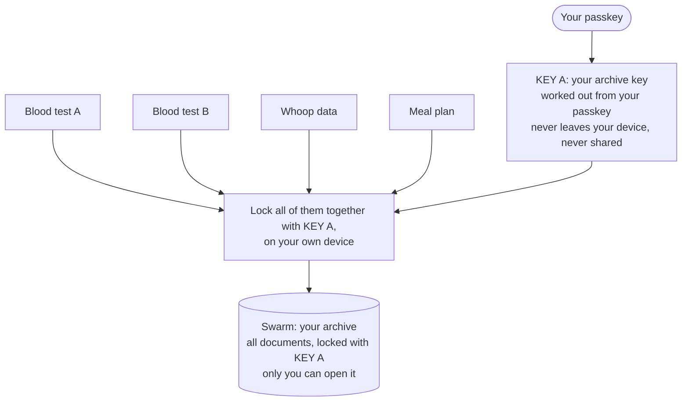
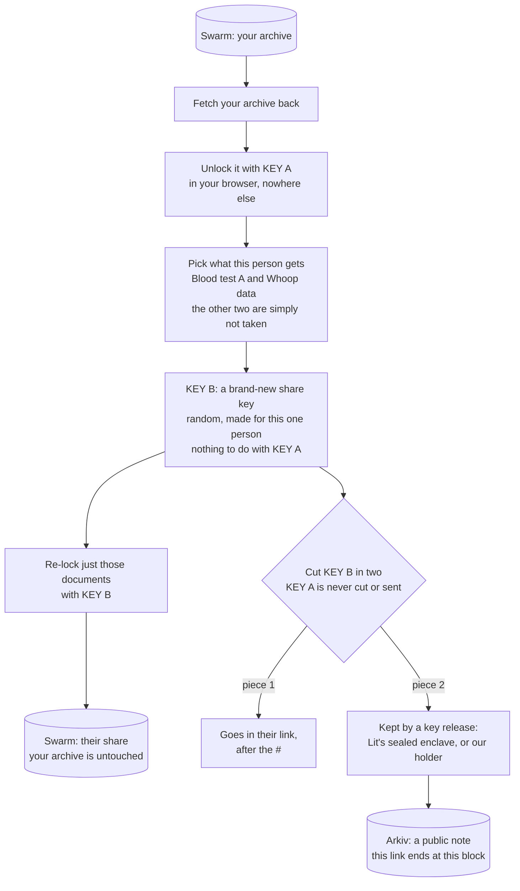
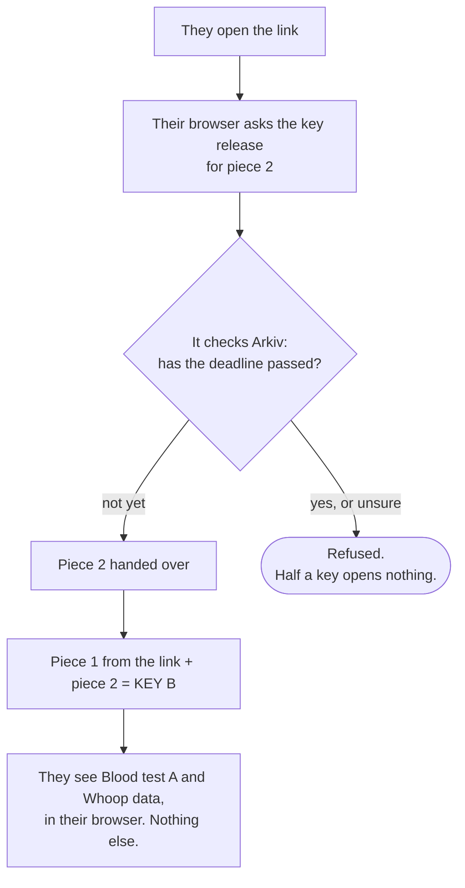

# HealthSend

**Share your health documents through a link that stops opening on the date you choose.**

Upload your blood-test PDFs once. Pick which ones a coach, nutritionist or doctor should see, and
set how long they can see them. Then send the link over WhatsApp or email. They need no account and
no wallet. When the time is up, the link stops opening on its own. Nobody has to remember to revoke
anything.

**Live: [healthsend.vercel.app](https://healthsend.vercel.app)** · Built at ETHRome 2026 · MIT licence
· Bounties: **Swarm**, **Arkiv** (Mission 02, Built to expire, and Best Use)

- [Try it in two minutes](#try-it-in-two-minutes)
- [How it works, in three pictures](#how-it-works-in-three-pictures)
- [Why Swarm, and where it is in the code](#why-swarm-and-where-it-is-in-the-code)
- [Why Arkiv, and where it is in the code](#why-arkiv-and-where-it-is-in-the-code)
- [What expiry does and does not do](#what-expiry-does-and-does-not-do)
- [Running it](#running-it) · [Verifying the claims](#verifying-the-claims)
- [Provenance and third-party components](#provenance-and-third-party-components)
- [Where it goes next](#where-it-goes-next)

---

## The problem

Health data sharing today is permanent access for a temporary relationship. A nutritionist you
see for twelve weeks keeps your lab results in their inbox forever. The usual fix is a company
that promises to stop serving the file. That is a promise, it makes the company a gatekeeper, and
someone can compel the company to break it.

HealthSend makes the time limit part of how the link works. Anyone can check whether a link has
ended; it's not something we decide.

## Try it in two minutes

**As a recipient (no setup at all):**
**[open a live send →](https://healthsend.vercel.app/s/0xa894be7a22e8b17db0d3ce49a5126fb39199c49f58ff26be670197cb1893ebb3#ugjTYmA8gV5bdy6hLXNGxc3g3_bRQEy-0a2tA_3XPww)**
in a private window. It holds three synthetic health documents, shared for seven days from
12 September 2026.
- No sign-in is offered, and there is no download button.
- The countdown comes from a real block height, not a timer in the page.
- After the window closes, the same URL shows "This link has expired", and nobody will have done
  anything.

**As a sender:**

1. Sign in at [healthsend.vercel.app](https://healthsend.vercel.app) with a Swarm ID passkey.
2. **Add blood tests:** pick one or several PDFs. They are encrypted on your device and stored on
   Swarm.
3. **New share:** tick the PDFs this person should see, choose **2 min**, and create the link.
4. Open the link in a private window: the PDFs render. Wait two minutes and reload: it has
   expired. Nothing was deleted in between.

> Sending needs a Swarm ID with a storage drive (gift codes from the Swarm desk at ETHRome).
> Receiving needs nothing.

## How it works, in three pictures

There are two kinds of key, on purpose:
- **Key A** locks your archive and never leaves your device.
- **Key B** is made fresh for each link and locks only what that person gets. It is the only key
  that is ever split.

### 1 · Upload once



### 2 · Share a slice, any day later



### 3 · They open the link



**Who keeps piece 2.**
- **Lit Chipotle,** for a share made from your archive without a code. It is a sealed enclave run
  by Lit, and it releases piece 2 through a registered action that checks Arkiv itself.
- **Our key-share holder,** for a share with a four-digit code. Only the holder counts wrong
  guesses and locks after five.

Either way, the Arkiv entity carries no key material. It holds only the Swarm reference, a
commitment and the deadline.

## Why Swarm, and where it is in the code

**Swarm earns its place because we never hold anyone's documents.** With S3 we would be the
custodian of a store of encrypted health documents, which could be breached, subpoenaed or
acquired. On Swarm:

- **Your archive is yours.** It is sealed under a key only your passkey can make, and located by
  a private feed derived from the same identity. Sign in on a second device and it is there.
- **It outlives us.** Shut HealthSend down and the encrypted files are still retrievable by hash.
- **Reading a file doesn't touch our servers.** Recipients fetch the encrypted file from a public
  gateway.
- **Swarm ID, no Bee node.** Senders sign in with a passkey and sign their own postage stamps in
  the browser.

| Where | What it does with Swarm |
|---|---|
| [`lib/swarm.ts`](./lib/swarm.ts) | Swarm ID client (`@snaha/swarm-id`): connect, `deriveAppSecret`, upload ciphertext, read from the public gateway |
| [`lib/identity.ts`](./lib/identity.ts) | Derives the archive key, the archive feed topic, the Arkiv signing key and the blinding key from the Swarm ID identity |
| [`lib/archive-store.ts`](./lib/archive-store.ts) | Upload once: reseal the archive, upload it, move the private feed |
| [`lib/assets.ts`](./lib/assets.ts) | Pack the chosen documents, seal them under a fresh share key, upload once |
| [`app/s/[key]/page.tsx`](./app/s/%5Bkey%5D/page.tsx) | Recipient: fetch ciphertext by hash, decrypt and render in place |

**What we deliberately don't use.** Neither of these can end access, and ending access is the
product:
- Swarm's encrypted references make the reference itself the key.
- Swarm's access control (ACT) keeps historical access for people who were once granted it.

## Why Arkiv, and where it is in the code

**Arkiv holds the one thing that must not be ours: the authority over when access ends.**

With an `expires_at` column in our own database, we would answer "has this ended?". We could extend
it, be compelled to, or get it wrong, and nobody outside could tell. On Arkiv:

- **Expiry is public.** The key release queries Arkiv. So can the recipient, the sender, or anyone
  else.
- **We can't extend it.** Every grant is `ownedBy` the sender's own key, derived from their Swarm
  ID. The expiry is pinned with `ExpirationTime.atBlock`, so it can't drift later.
- **Absence is the signal.** When the block passes, the entity stops matching queries on its own,
  and the key release refuses. No job runs and no delete call is made. That is Mission 02.
- **The sender checks their own history** through a compound query, not an API of ours.
- **Nothing sensitive goes in.** Recipient and label attributes are HMAC-blinded under a key the
  sender holds. File contents never go near Arkiv.

| Where | What it does with Arkiv |
|---|---|
| [`lib/arkiv.ts`](./lib/arkiv.ts) | Writes grants with typed attributes (`app`, `kind`, `sender`, `filetype`, `file_count`, `recipient`, `label`, `expires_block`) and `atBlock` expiry. Also the dashboard's compound query, and the binding query (`$owner`, `$expiresAt`) a key release uses |
| [`lib/key-release/chipotle-action.js`](./lib/key-release/chipotle-action.js) | The Lit action: re-checks the grant's commitment, then queries Arkiv directly before releasing piece 2 |
| [`app/api/holder/unlock/route.ts`](./app/api/holder/unlock/route.ts) | The holder's check that the grant is still live before it serves anything |
| [`app/(sender)/shares/page.tsx`](./app/(sender)/shares/page.tsx) | Your shares: live grants, their countdowns, ending one early |
| [`arkiv/schema.md`](./arkiv/schema.md) · [`friction.md`](./friction.md) | Attributes, queries and lifetime (its payload section is the superseded v1 model; the current payload is `GrantPayload` in `lib/arkiv.ts`), and what broke along the way |
| [`arkiv/evidence/mission-02-expiry.txt`](./arkiv/evidence/mission-02-expiry.txt) | Mission 02: the same query before and after the boundary, no delete call |

### Every combination, scored the same way

Three properties decide whether the product is honest:
- **Custody:** we never hold the documents.
- **Authority:** we don't decide whether access is still valid.
- **Expiry:** access can actually end.

| Architecture | Custody | Authority | Expiry | What it really is |
|---|:--:|:--:|:--:|---|
| Postgres + S3 | ❌ | ❌ | ✅ | The incumbent. |
| Swarm only | ✅ | — | ❌ | Permanent sharing: the link is the key, forever. |
| Arkiv + S3 | ❌ | ✅ | ✅ | Expiry works because *we* delete the file. |
| Swarm + a key-value store with a timer | ✅ | ❌ | ✅ | Expires on **our** timer. A gatekeeper with good manners. |
| Swarm + Arkiv, key in the grant (our v1) | ✅ | ✅ | ❌ | No working expiry. [See below](#what-expiry-does-and-does-not-do). |
| **Swarm + Arkiv + a key release** (*what ships*) | ✅ | ✅ | ✅ | The only row with all three. |

## What expiry does and does not do

**We got this wrong first, and the correction is the most useful thing in this repository.**

Our first version put a wrapped key inside the Arkiv grant, assuming the key was gone once the
grant expired. It isn't:
- An Arkiv entity is created by a transaction.
- Expiry removes it from the live query results, not from chain history.
- So anyone who saved the payload while it was live could decrypt later, using a leaked link.

Check it against one of our expired v1 grants:

```bash
node scripts/payload-survives.mjs \
  0xb7f157f7d615379a5fc06cb499fc49aa49814edb776c7eae6dfa3544f34411a6 \
  0x5f9b5f13eaed3e43f3c8903c865248e05546cb9e2dea72e60d6e86ca12b1e905
# status   gone from the query surface
# PAYLOAD RECOVERED FROM CALLDATA: {"v":1,"ref":"demo-swarm-reference","wrap":{"iv":"x","ct":"y"}}
```

The fix is the split key above: key material stays out of anything public and sits behind a party
that can refuse. Run the same script on a current grant and it reports *"no key material"*.

What that buys, precisely:

| Claim | True? |
|---|---|
| Documents are encrypted on your device; no server of ours receives plaintext | **Yes** |
| After the deadline, someone opening the link gets nothing | **Yes** |
| A link that leaks later (an old bookmark, a forwarded message) is useless | **Yes** for holder shares. **Not yet** for Lit Chipotle shares: our review found the Lit action can be fed a self-made live grant, so anyone who kept a Chipotle link can still recover its key after it ends. The fix (H-72) seals the grant into the Lit ciphertext. |
| Expiry erases the document | **No.** Encrypted files on Swarm and grant calldata are permanent. Expiry ends *access*, not *existence*. |
| Expiry takes back what someone already saw | **No.** A screenshot taken during the window stays a screenshot. |

### The cost, stated plainly

- **Something can refuse, so something can fail.** If the key release is unreachable, a live link
  stops opening early. The recipient sees *"Temporarily unavailable"*, never *"expired"*. If
  nothing can break access, nothing can end it: they are the same mechanism.
- **You trust the key release to refuse.**
  - Lit Chipotle is an enclave service run by Lit, with a TEE-derived key. It is not a
    decentralised or threshold network.
  - Our holder is a server of ours.
  - We also built a TACo (threshold) adapter. It is parked until TACo's network is reachable
    ([evidence](./arkiv/evidence/taco-adapter-poc.md)).
- **The code that decrypts comes from our deployment.** Encrypting in the browser limits what a
  thief of stored data can reach. It doesn't limit what someone who controls our published code
  can reach.
- **PDFs are shared as issued.** A name or date of birth printed on a PDF goes with it, and the
  share screen says so before the link exists.

## Running it

```bash
pnpm install
cp .env.example .env.local   # fill in the values below
pnpm doctor                  # Arkiv RPC, funder balance, Swarm gateway, Swarm ID origin
pnpm dev
```

| Variable | Why |
|---|---|
| `ARKIV_FUNDER_PRIVATE_KEY` | A throwaway testnet key that tops up each user's derived Arkiv key with gas (`/api/fund`) |
| `KV_REST_API_URL`, `KV_REST_API_TOKEN` | Redis REST store for the key-share holder |
| `NEXT_PUBLIC_CHIPOTLE_*` | Optional Lit Chipotle key release. Leave `NEXT_PUBLIC_CHIPOTLE_ENABLED=false` to use the holder only |

Two things can't be scripted, so do them first:

1. **Test GLM for the funder key.** The [Arkiv faucet](https://hub.arkiv.network/faucet) pays the
   wallet you connect, so:
   - Import `ARKIV_FUNDER_PRIVATE_KEY` into MetaMask.
   - Add the Tiramisu network: RPC `https://rpc.tiramisu.db-chain.testnet.arkiv.network`, chain id
     `7738577`, symbol `GLM`.
   - Claim, then re-run `pnpm doctor`.
2. **A storage drive on your Swarm ID.** At ETHRome, the Swarm desk hands out gift codes; otherwise
   buy one in the [Swarm ID app](https://swarm-id.snaha.net). Sign-in shows `canUpload: false`
   until you have one.

> Swarm ID app secrets are scoped to identity **and origin**. `localhost:3000` and the deployed
> site derive different keys from the same passkey, so they have separate archives and shares.

## Verifying the claims

```bash
pnpm verify:crypto        # split key round-trips; the holder's own view can't decrypt; no key in the commitment
pnpm verify:expiry 60     # writes a 60-second grant, runs the same query before and after, no delete call
pnpm e2e                  # recipient states in a clean browser: expired, ended early, unavailable, wrong link
RUN_CHIPOTLE_LIVE_PROBE=1 pnpm verify:chipotle-adapter-live   # Lit refuses a release for a grant Arkiv doesn't have
```

A recorded Mission 02 run against Tiramisu. The full file,
[`arkiv/evidence/mission-02-expiry.txt`](./arkiv/evidence/mission-02-expiry.txt), includes the
entity key and transaction hash:

```
BEFORE   query returns 1 row(s)
         t+56s rows=1
         t+66s rows=0
AFTER    query returns 0 row(s)
PASS  the grant expired on its own.
```

## Layout

```
lib/crypto.ts            split key, commitments, the four-digit code
lib/swarm.ts             Swarm ID for the sender, public gateway for the recipient
lib/identity.ts          every per-user key, derived from the Swarm ID identity
lib/archive*.ts          the sealed archive: PDFs, the share index, upload once
lib/assets.ts            pack and seal the documents for one share
lib/arkiv.ts             grants: typed attributes, atBlock expiry, queries
lib/key-release/         Lit Chipotle (live), TACo (parked), one factory choosing between them
lib/sends.ts             create a share and open a share, end to end
app/(sender)/            your archive, new share, your shares
app/s/[key]/             recipient: no account, renders in place, no download
app/api/holder/          key-share holder: share, unlock, revoke, access log
app/api/fund/            gas top-ups for user-derived Arkiv keys (hackathon scaffolding)
arkiv/                   schema, and recorded evidence
scripts/                 doctor and every verify:* proof
e2e/                     Playwright, in clean browser contexts
```

## Provenance and third-party components

Built at ETHRome 2026, Friday 11 September 18:00 – Sunday 13 September 10:00.

- **All code in this repository was written during the hackathon.** The git history is the record.
- **Two planning documents predate the event.** Both were written on 3 September, and both are prose
  only: [`healthsend-brief.md`](./healthsend-brief.md) and [`DESIGN.md`](./DESIGN.md), plus a
  Pencil design file. No code, schema or configuration came from them.

**Third-party components:**
- [Swarm ID](https://github.com/snaha/swarm-id) (`@snaha/swarm-id`)
- [Arkiv SDK](https://www.npmjs.com/package/@arkiv-network/sdk) (`@arkiv-network/sdk`)
- [Lit Chipotle](https://developer.litprotocol.com) (HTTP API)
- [TACo](https://www.npmjs.com/package/@nucypher/taco) (`@nucypher/taco`, parked)
- Upstash Redis (`@upstash/redis`)
- The MCP SDK (`@modelcontextprotocol/sdk`)
- Next.js, React, viem, ethers, zod, Phosphor Icons, Tailwind CSS and Playwright
- Hosted on Vercel.

## Where it goes next

**Next: share the rest of a health record.** That means wearable exports and structured lab values,
with identifiers removed before they leave the device. It also means letting practitioners who
receive one link start sending their own.

**Built but hidden for now:** an assistant connector (MCP) that gives an AI tool an expiring slice
of your archive.

**Designed but not built:**
- Claim-on-first-open, which locks a link to the first device that opens it.
- A self-hosted identity layer that removes Swarm ID's extra windows at first sign-in
  ([write-up](./docs/identity-and-onboarding.md)).
